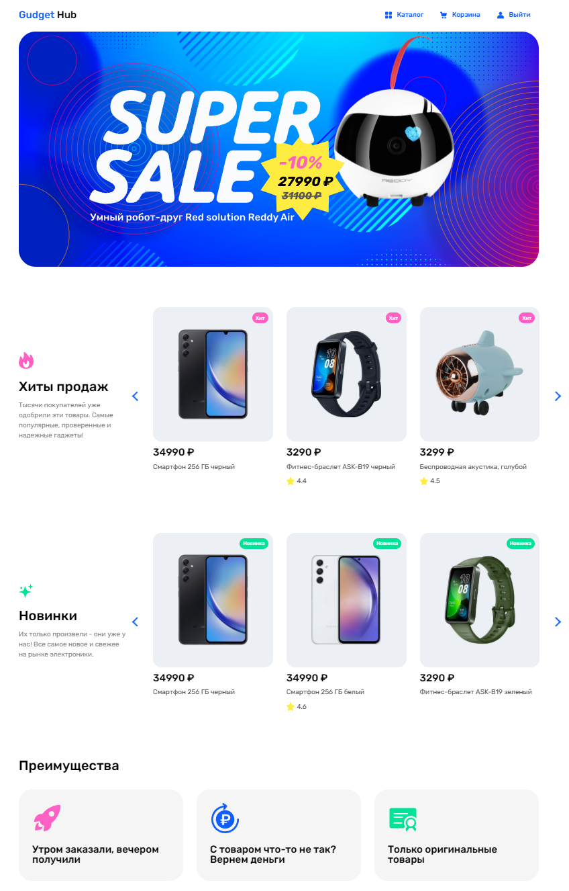
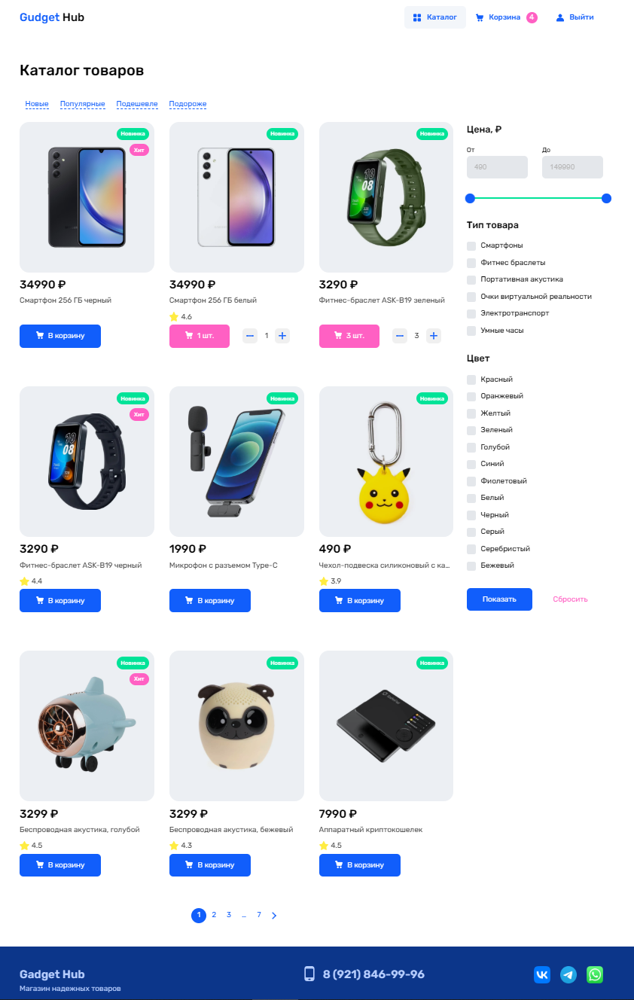
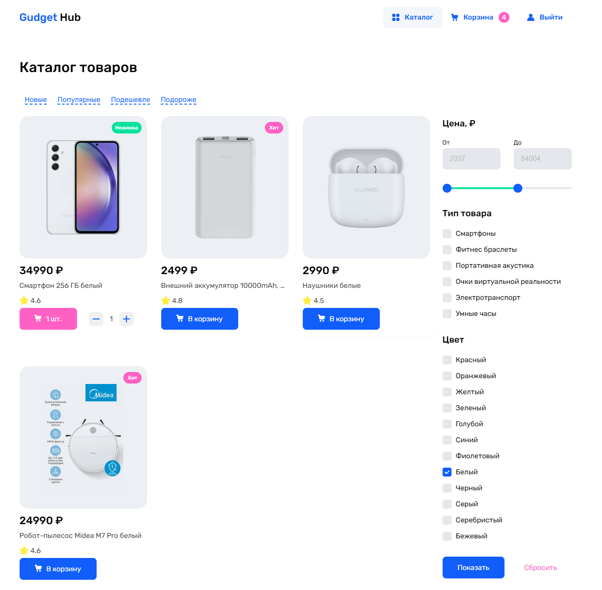
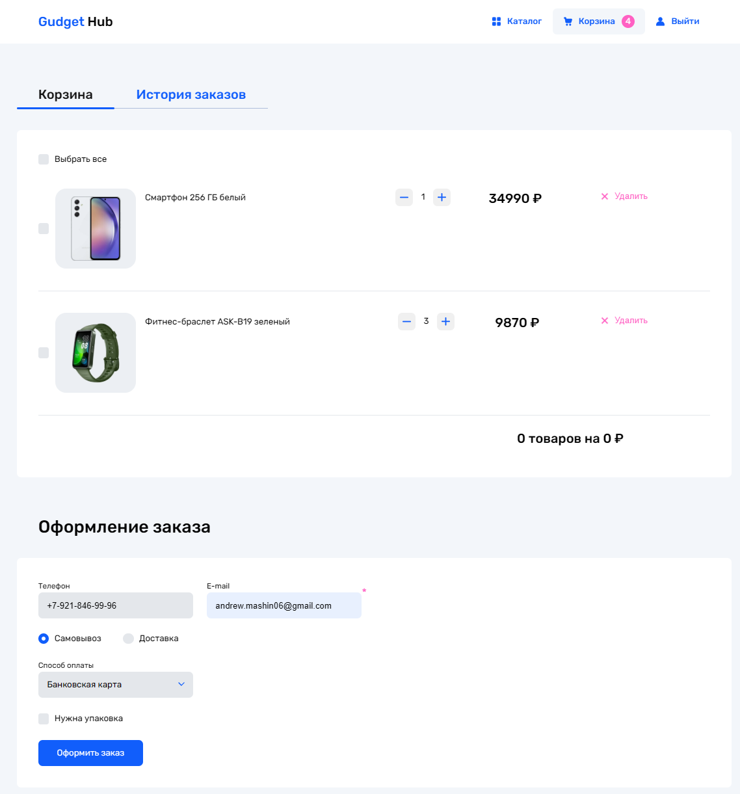

# 🛒 Gadget Hub — интернет-магазин электроники

SPA-магазин электроники с каталогом, фильтрами, корзиной и оформлением заказа.
Полный цикл: React-фронтенд + собственный FastAPI-бэкенд, без сторонних BaaS-решений — вся бизнес-логика (авторизация, синхронизация корзины, оформление заказа) написана с нуля.

**Стек:** React 19 · TypeScript · MobX · React Router · FastAPI · Python

<p align="center">
  
  
</p>

---

## О проекте

Учебно-демонстрационный проект, реализующий типичный флоу интернет-магазина: пользователь логинится, просматривает каталог с фильтрами и сортировкой, собирает корзину (которая сохраняется между сессиями и устройствами через бэкенд), оформляет заказ и видит историю покупок.

Цель проекта — показать умение:
- спроектировать frontend-архитектуру на MobX без лишней связанности сторов;
- написать backend с REST API и файловым хранилищем данных;
- связать оба слоя в рабочее end-to-end приложение.

## Функциональность

- **Главная** — баннер, слайдер товаров
- **Каталог** (доступен только авторизованным пользователям) — фильтрация по цене (слайдер диапазона), категории и цвету; сортировка по новизне/популярности/цене; пагинация; модальное окно с карточкой товара

  

- **Корзина** — добавление/удаление товаров, выбор части товаров для заказа, оформление (доставка/самовывоз, оплата), история предыдущих заказов

  

- **Профиль** — вход по логину/паролю с валидацией на клиенте и проверкой на сервере, выход

  

## Архитектурные решения

**Разделение состояния на независимые сторы.** Авторизация (`AuthStore`) и корзина (`CartStore`) — два самостоятельных MobX-стора, не знающих друг о друге напрямую. Их координация (например: «после логина подтянуть корзину пользователя с сервера») вынесена в отдельный `RootStore`. Это позволяет тестировать и переиспользовать каждый стор изолированно, не тащя за собой зависимость от другого.

**Синхронизация корзины с бэкендом.** Корзина живёт в `localStorage` для гостя и синхронизируется с сервером при входе/выходе пользователя, чтобы состояние не терялось между сессиями и устройствами.

**Backend без ORM.** Вместо полноценной БД — файловое JSON-хранилище (`database/users.json`, `database/goods.json`), перезаписываемое на диск при каждом изменении. Осознанное упрощение для учебного проекта: позволило сосредоточиться на API и клиентской логике, а не на настройке БД.

## Стек подробно

**Frontend** (`frontend/`)
- React 19 + TypeScript, сборка на Vite
- React Router — маршрутизация
- MobX + `mobx-react-lite` — реактивное состояние (авторизация, корзина)
- `nouislider` — слайдер диапазона цен в фильтре
- SCSS, по одному файлу стилей на страницу

**Backend** (`backend/`)
- Python, FastAPI
- REST API из 7 эндпоинтов (товары, авторизация, корзина, заказы)
- Хранилище — плоские JSON-файлы

## API

| Метод | Путь | Назначение |
|-------|------|-----------|
| GET | `/goods` | список товаров |
| POST | `/login` | вход по логину/паролю |
| POST | `/logout` | выход |
| GET | `/cart/{username}` | получить сохранённую корзину пользователя |
| POST | `/cart/save` | сохранить корзину пользователя |
| GET | `/orders/{username}` | история заказов пользователя |
| POST | `/orders` | оформить новый заказ (очищает корзину) |

## Структура проекта

```
Проект/
├── backend/
│   ├── main.py                 # FastAPI-приложение, все эндпоинты
│   └── database/
│       ├── users.json          # логины/пароли, корзина и заказы каждого пользователя
│       └── goods.json          # каталог товаров
└── frontend/
    └── src/
        ├── components/          # компоненты по страницам (cart-page/, catalog-page/, home-page/)
        ├── pages/                # HomePage, CatalogPage, CartPage, ProfilePage, NotFoundPage
        ├── stores/               # AuthStore, CartStore, RootStore
        ├── styles/               # SCSS по одному файлу на страницу
        ├── utils/                # типы, фильтрация/сортировка/пагинация
        ├── App.tsx               # роутинг, загрузка списка товаров
        └── main.tsx              # точка входа
```

## Установка и запуск

**Backend**

```bash
cd backend
pip install fastapi uvicorn
uvicorn main:app --reload --port 8080
```

**Frontend**

```bash
cd frontend
npm install
npm run dev
```

Фронтенд запускается на `http://localhost:3000`, бэкенд должен быть доступен на `http://127.0.0.1:8080`.

## Что можно улучшить

Осознанно оставленные упрощения — если бы проект уходил в продакшн, в первую очередь стоило бы сделать:

- вынести URL API в переменные окружения (`VITE_API_URL`) вместо хардкода в нескольких файлах
- хешировать пароли вместо хранения в открытом виде
- перейти с файлового JSON-хранилища на настоящую БД (текущее не потокобезопасно при параллельных запросах)
- добавить `requirements.txt` для backend-зависимостей
- перенести валидацию форм с клиента на сервер как основной источник истины